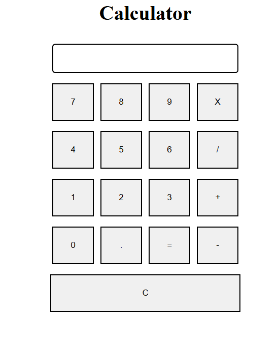

# Basic Calculator

A simple web-based calculator implemented using HTML, CSS, and JavaScript.

## Introduction

This basic calculator is designed to perform simple arithmetic operations such as addition, subtraction, multiplication, and division. It provides a user-friendly interface for performing calculations quickly and easily.

## Features

- Responsive design for desktop and mobile devices.
- Clear button to reset the calculator.
- Error handling for invalid input or calculations.
- Supports addition, subtraction, multiplication, and division.
- Keyboard support for improved usability.

## Usage

To use the calculator, simply follow these steps:

1. Clone or download the repository to your local machine.
2. Open the `index.html` file in your web browser.
3. Use the buttons to input numbers and perform calculations.
4. Click the "C" button to clear the display.
5. Press "=" or the "Enter" key to see the result of the calculation.

